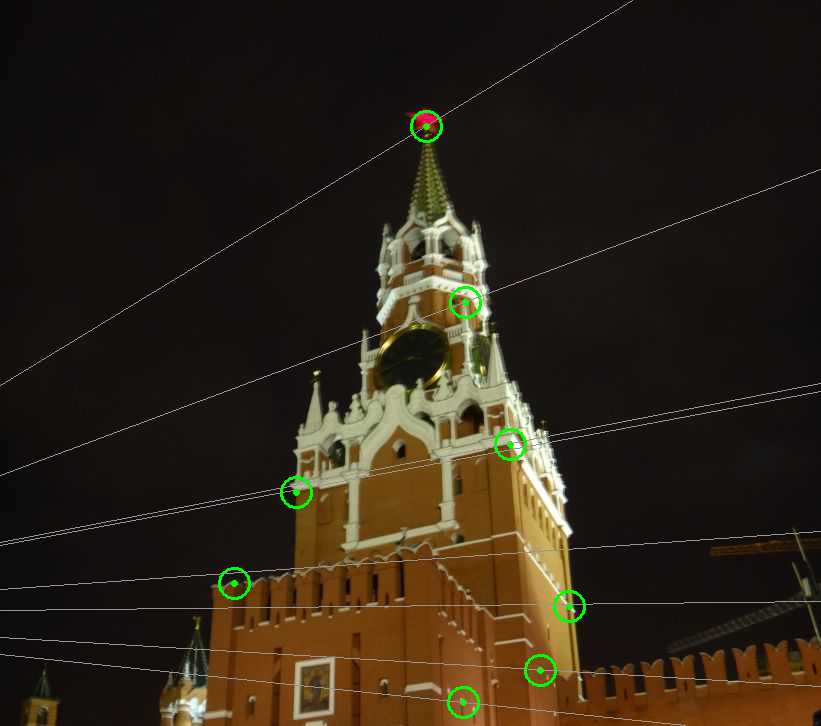

<html>
<body>

<h1>Introduction</h1>

Current project contains several exercises in Photogrammetric Computer Vision and Digital Image Analysis, performed in C++ using OpenCV library. In order to launch an exercise, run the corresponding bat-file, which specifies arguments required for executable of every exercise.

<h1>Panorama creation</h1>

Creation of a panorama from 3 images. Three photos of the same planar object were taken using slightly different horizontal orientation of the camera. Program performs stitching of the left image to a center one and then stitching of the right image to the result. For every stitching operation user chooses 4 pairs of matching points. From image coordinates of these points homography in 2D is calculated and applied. Resulting image is stored on the disk.  
Input files:  
ph_left.jpg, ph_mid.jpg, ph_rig.jpg  

Output file:   
panorama.jpg   

<h1>Calculation of interior and exterior camera parameters</h1>

Calculation of internal and external parameters of the image. User provides a txt-file with homogeneous 
spacial coordinates of points on the object (cube) and finds these points on the image of this object.   
Input files:    
points.jpg   
  

points.txt   
35 10 0   
15 25 0   
25 0 45   
15 0 10   
0 10 40   
0 40 25   

Output file:   
result.txt   

<h1>Epipolar lines</h1>

Computation of epipolar lines on the images of the same object taken from different viewpoints. 
User chooses 8 pairs of matching points. Images with epipolar lines are shown and saved.   

Input files:   
krem1.jpg    
  

krem2.jpg     
  

Output files:   
fst.png    
  

snd.png    
  

<h1>Object in 3D</h1>

Calculation of 3D euclidean coordinates of points of a 3D-object from known coordinates of these 
points on two images of this object. Input file bh.dat contains 
more than 1000 lines. Each line consists of x, y pixel coordinates of a point on the first 
image and x, y coordinates of the same point on the second image. Input file pp.dat contains 5 lines, each line consists of x, y pixel coordinates of a point on the first image, x, y coordinates 
of the same point on the second image and X, Y, Z coordinates of this point on the 3D object. 
Program calculates fundamental matrix and than sets projection matrix of one camera as known 
and calculates projection matrix of the second camera. Known projection matrices lead to 
linear triangulation. To upgrade described reconstruction from projective to euclidean, 
control points are used. Required 3D homography is calculated and applied to the whole 
point cloud. Result is a point cloud in euclidean coordinates.   
Input files:  
bh.dat, pp.dat   
Output files:  
projectiveReconstruction.asc, euclidianReconstruction.asc   

<h1>Image restoration</h1>

<h1>Unsharp masking</h1>

</body>
</html>