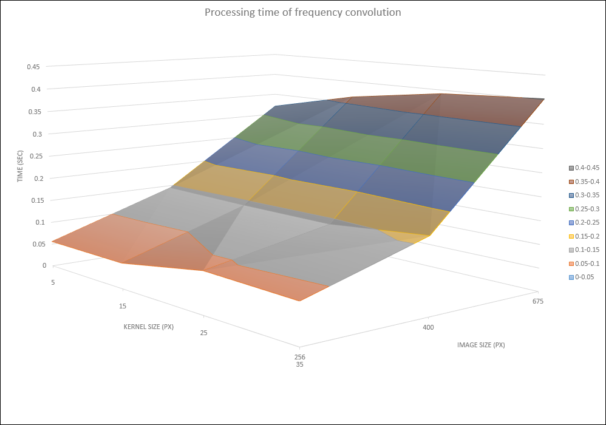

<html>
<body>

<h1>Introduction</h1>

Current project contains several exercises in Photogrammetric Computer Vision and Digital Image Analysis, performed in C++ using OpenCV library. In order to launch an exercise, run the corresponding bat-file, which specifies arguments required for executable of every exercise.

<h1>Panorama creation</h1>

Creation of a panorama from 3 images. Three photos of the same planar object were taken using slightly different horizontal orientation of the camera. Program performs stitching of the left image to a center one and then stitching of the right image to the result. For every stitching operation user chooses 4 pairs of matching points. From image coordinates of these points homography in 2D is calculated and applied. Resulting image is stored on the disk.    
Input files:  
ph_left.jpg, ph_mid.jpg, ph_rig.jpg  

    
Output file:   
panorama.jpg   

<h1>Calculation of interior and exterior camera parameters</h1>

Calculation of internal and external parameters of the image. User provides a txt-file with homogeneous 
spacial coordinates of points on the object (cube) and clicks these points in the same order on the image of this object.    

Input files:    
points.txt   
35 10 0   
15 25 0   
25 0 45   
15 0 10   
0 10 40   
0 40 25     

points.jpg   
    

Output file: 

result.txt   
    
<!--
Output file:  
result.txt   
Calibration matrix:  
[3759.0095, -97.234528, 1662.9592; 
 0, 3715.8079, 1933.791; 
 0, 0, 0.99999994] 
 
Rotation matrix:  
[-0.70572937, 0.70612901, -0.057687514; 
 -0.54553491, -0.4896597, 0.68016547; 
 0.45203733, 0.51148331, 0.73078525] 
 
Principle distance:		3759.01 
Skew:				88.5183 
Aspect ratio:			0.988507 
Principle point (x,y):		[1662.96, 1933.79]^T 
 
omega:	-34.9885 
phi:	26.8745 
kappa:	142.296 
 
external position:	[-71.3666, -72.8878, -66.2356]^T -->

<h1>Epipolar lines</h1>

Computation of epipolar lines on the images of the same object taken from different viewpoints. 
User chooses 8 pairs of matching points. Images with epipolar lines are shown and saved.     

Input files:   
krem1.jpg    
    

krem2.jpg     
    

Output files:   
fst.png    
    

snd.png    
    

<h1>Object in 3D</h1>

Calculation of 3D euclidean coordinates of points of a 3D-object from known coordinates of these 
points on two images of this object. Input file bh.dat contains 
more than 1000 lines. Each line consists of x, y pixel coordinates of a point on the first 
image and x, y coordinates of the same point on the second image. Input file pp.dat contains 5 lines, each line consists of x, y pixel coordinates of a point on the first image, x, y coordinates 
of the same point on the second image and X, Y, Z coordinates of this point on the 3D object. These 5 points are used as control points.
Program calculates fundamental matrix and than sets projection matrix of one camera as known 
and calculates projection matrix of the second camera. Known projection matrices lead to 
linear triangulation. To upgrade described reconstruction from projective to euclidean, 
control points are used. Required 3D homography is calculated and applied to the whole 
point cloud. Result is a point cloud in euclidean coordinates. Visualisation of the result shows that the point cloud represents a part of bust of Ludwig van Beethoven.   
Input files:  
bh.dat, pp.dat     
Output files:  
projectiveReconstruction.asc, euclidianReconstruction.asc     
Visualisation of the file euclidianReconstruction.asc:  
    

<h1>Image restoration</h1>
This exercise deals with image filtering methods. In the beginning two noises are applied for an input image: salt-and-pepper noise and gaussian noise. Both degraded images are processed by 3 filters: averaging filter, median filter and bilateral filter.  
Input files:  
original.jpg  
    
Results of application of salt-and-pepper noise and gaussian noise:  
noiseType_1.jpg, noiseType_2.jpg  

    
Results of application of averafing filter to noised images:  
restorated_n1_ave.jpg, restorated_n2_ave.jpg  

    
Results of application of median filter to noised images:  
restorated_n1_med.jpg, restorated_n2_med.jpg  

    
Results of application of bilateral filter to noised images:  
restorated_n1_bil.jpg, restorated_n2_bil.jpg  

    
As a result, median filter seems to be the best choise for denoising of given images.

<h1>Unsharp masking</h1>

Current exercise performs operation of unsharp masking on several degraded images. Unsharp masking is a technique of image enhancement which increases local contrast of image edges, so that image is perceived as more sharp. The technique creates a blurry copy of degraded image, subtracts it from initial degraded image, thresholds and scales the difference and then adds the result to initial degraded image. The effect is shown on the following picture, where the lower part is result of unsharp masking:  
    

Operation of unsharp masking was applied to several different-sized images and processing time was also measured. Smoothing of the initial image is done by convolution. This fact is used to compare processing time of convolution of different-sized images (256х256, 400x400, 675x675 pixels) by different-sized kernels (5x5, 15x15, 25x25, 35x35 and 45x45) in spatial and in frequency domain. Results of unsharp masking applied for degraded images on the left are shown on the right side:  

    
Dependency on processing time on image size and kernel size is shown on the following graphs:  

    
As it can be seen on graphs, in case of spatial convolution processing time increases with growth of image size and with growth of kernel size. But in case of frequency convolution, processing time does not depend on kernel size, only on image size. The reason of such effect is that in spatial domain kernel size defines number of multiplications performed for convolution, but in frequency domain size of the kernel is increased to the image size, transformed to frequency domain and is multiplied with frequency domain representation of image in an element-by-element manner. Moreover, convolution in frequency domain is just much faster than in spatial domain even for similar image and kernel sizes. 

<!--Unsharp masking is a technique of image processing which achieves effect of perception of image's greater sharpness by contrast magnification of edges. This effect is shown on the following picture:
    
It is achieved by the following steps: <ol> 
<li>y1 - result of smoothing of initial image y0;</li>
<li>y2 - result of subtraction of y1 from y0;</li>
<li>y3 - result of thresholding and scaling of y2;</li>
<li>y4 - result of summation of y0 and y3;</li>    
Current exercise performs unsharp masking of several different-sized images and measures processing time. Smoothing of the initial image is done by convolution. This fact is used to compare processing time of convolution of different-sized images (256х256, 400x400, 675x675 pixels) by different-sized kernels (5x5, 15x15, 25x25 and 35x35) in spatial and in frequency domain. 
Blurry copy of degraded image from the first step can be created either by convolution either in spatial or in frequency domain. Both options were used in order to compare influence of such parameters as image size and kernel size on calculation time. -->

</body>
</html>
